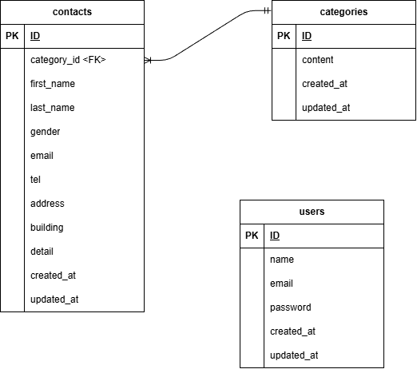

# test-form
ログイン機能付きお問い合わせフォーム管理アプリです。

## 環境構築

```bash
git clone git@github.com:kanon-non-mad/test-form.git
cd test-form/src
docker-compose up -d --build
```

## Laravel環境構築

```bash
docker-compose exec php bash
composer install
cp .env.example .env
php artisan key:generate
php artisan migrate
php artisan db:seed
```

## 開発環境
- お問い合わせ画面：http://localhost
- ユーザー登録：http://localhost/register
- ログイン画面：http://localhost/login
- 管理画面：http://localhost/admin

## 使用技術

- PHP 7.4
- Laravel 8.x
- MySQL 8.0.26
- Docker compose
- nginx 1.21.1

## ER図


--- 

## 機能一覧

- ユーザー登録機能
- ログイン機能
- お問い合わせ入力機能
- バリデーション
- 確認画面
- 管理画面
- 検索機能
- モーダル表示
- 削除機能

---

## テストアカウント

email: test2@example.com
password: test1234

## 工夫した点

- 複数条件検索を実装
- categoryテーブルとのリレーション設定